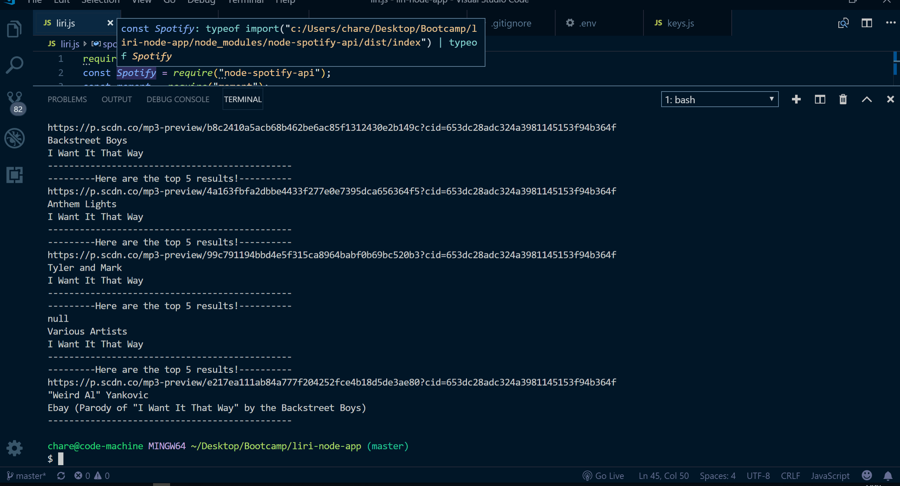

# liri-node-app
# Description
This bot takes in one of three commands from the terminal and displays the requested information inside the terminal. The commands can be a search request for a movie, song, or concert. The user will use the command 'spotify-this-song' and the bot will search the spotify API and return a link to the song, the artist name and the title of the song. The command 'concert-this' will search the Bands In Town API and return upcoming shows for the requested band with a date and location of the venue. The command 'movie-this' will search the OMDb API and return title, year, rating, country, language plot and actors of the requested movie. Finally the command 'do-what-it-says' will read the text inside the file random.txt and use the data to return the request. 

# Technologies Used
- nodeJS
- JavaScript
- npm (axios, moment, spotify, fs)

# APIS Used
- OMDb
- Spotify
- Bands In Town

